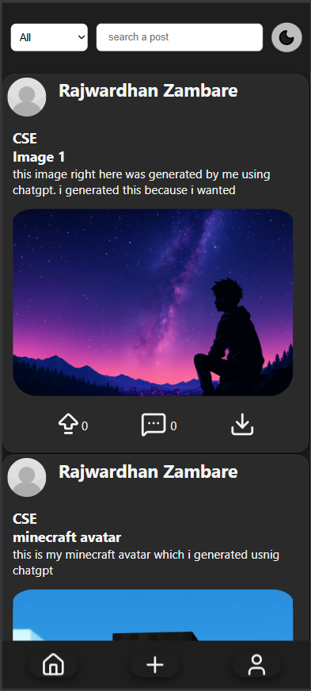
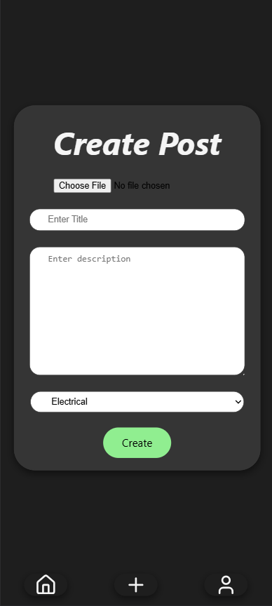
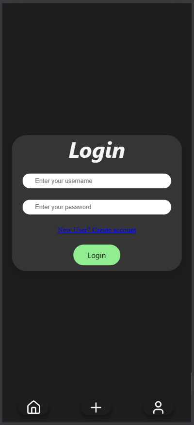

# 🎓 CampusResolve

A **campus issue reporting and resolution platform** that allows students to post problems related to their department or campus facilities. Other students can upvote issues and administrators can mark them as resolved.

This platform helps ensure that **important student concerns reach the right authorities and get resolved quickly.**

---

## 🚀 Features

- 📝 **Post Campus Issues**  
  Students can upload issues with an image, caption, and title.

- 🏫 **Department-wise Filtering**  
  View issues specific to departments (CSE, MECHANICAL, etc.).

- 👍 **Upvote System**  
  Important issues rise to the top through student upvotes.

- 👨‍💼 **Admin Resolution System**  
  Admin can mark issues as **resolved** or can **delete** the post aswell.

- 🌙 **Dark Mode UI**

- 📱 **Responsive Feed Interface**

---

## 🛠 Tech Stack

### Frontend
- React.js
- Axios
- CSS

### Backend
- Node.js
- Express.js
- MongoDB
- Mongoose

---

## 📂 Project Structure

```
CampusResolve
│
├── backend
│   ├── models
│   ├── routes
│   ├── server.js
│   └── package.json
│
├── frontend
│   ├── src
│   │   ├── components
│   │   ├── pages
│   │   ├── css
│   │   └── App.jsx
│   │
│   └── package.json
│
└── README.md
```

---

## ⚙️ Installation

### 1️⃣ Clone the Repository

```bash
git clone https://github.com/RajwardhanZambare/CampusResolve.git
cd CampusResolve
```

---

### 2️⃣ Setup Backend

```bash
cd backend
npm install
```

Create a `.env` file in the backend folder:

```
DATABASE_URI=your_mongodb_connection_string
PORT=3000
```

Run the backend:

```bash
node --env-file=.env server.js
```

---

### 3️⃣ Setup Frontend

Open a new terminal and run:

```bash
cd frontend
npm install
npm run dev
```

---

## 📸 Screenshots

### Feed Page


### Create Post


### Login


### Resolved And Delete Issue


---

## 📌 Future Improvements

- Authentication system (Student/Admin login)
- Real-time notifications
- Comment system
- Issue prioritization
- Mobile responsive improvements
- Deployment on cloud (Render / Vercel)

---

## 👨‍💻 Author

**Rajwardhan**  
Computer Science Engineering Student

---

## ⭐ Support

If you like this project, consider giving it a **star ⭐ on GitHub**.